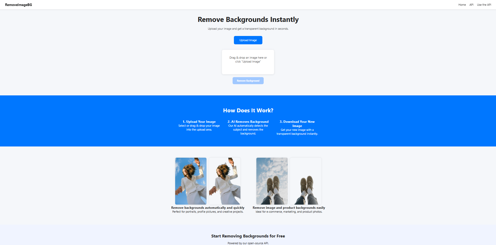
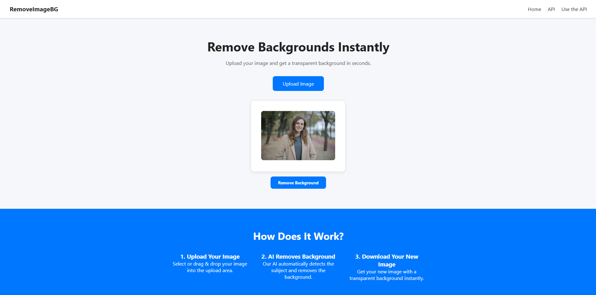
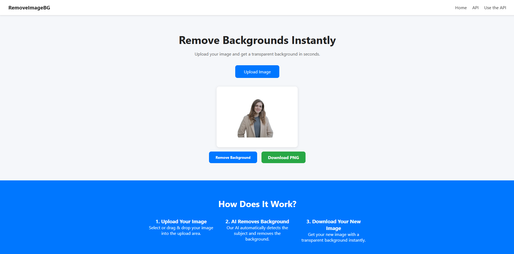
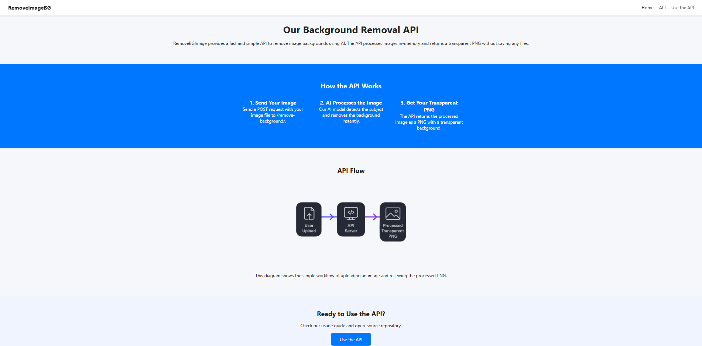
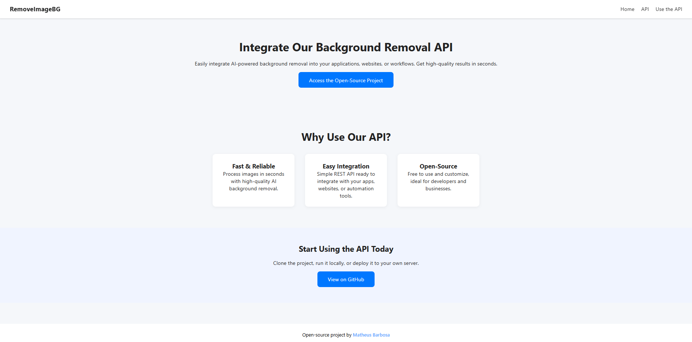

# RemoveImageBG

**RemoveImageBG** is a complete full-stack application that allows users to remove backgrounds from images using a modern frontend and a powerful backend.

This project includes:
- A clean, responsive website for image upload and preview
- Background removal using a Python/Django RESTful API with [`rembg`](https://github.com/danielgatis/rembg)
- Integration between frontend and backend using JavaScript (Fetch API)
- Local development setup using only free and open-source tools

> ✅ Backend-only version is also available at:  
> https://github.com/MatheusBarbosaSE/remove-bg-api

---

## ✨ Features

- 📤 Upload or drag & drop image support
- 🧠 Background removal (rembg + onnxruntime)
- 📥 One-click download of the result in PNG format
- 💻 Responsive layout, ideal for desktop and mobile
- 🔗 Open-source and easy to integrate

---

## 🧠 How It Works

The project consists of two main parts:

### 1. Frontend (HTML, CSS, JS)

- Upload and preview image using drag & drop or file input
- JavaScript sends the image to the backend via a `POST` request
- Displays the processed image with a transparent background
- Allows downloading the processed image in one click

### 2. Backend (Django + Django REST Framework)

- Endpoint: `/api/remove-background/`
- Receives image via POST
- Uses `rembg` and `onnxruntime` to remove the background
- Returns the image in-memory as a transparent PNG
- No images are saved on disk

---

## 📦 Requirements

- Python 3.10+
- Virtual environment (recommended)
- Dependencies listed in `requirements.txt`:
  ```txt
  Django==5.2.4
  djangorestframework==3.16.0
  django-cors-headers==4.7.0
  rembg==2.0.67
  onnxruntime==1.22.1
  pillow
  python-decouple==3.8
  ```

---

## 🛠️ Local Setup (Frontend + Backend)

### 1. Clone the repository

```bash
git clone https://github.com/MatheusBarbosaSE/remove-image-bg.git
cd remove-image-bg
```

### 2. Setup virtual environment (recommended)

```bash
python -m venv venv

# Activate (choose your OS)
# Windows (PowerShell)
venv\Scripts\activate

# Linux/Mac
source venv/bin/activate
```

### 3. Install Python dependencies

```bash
pip install --upgrade pip
pip install -r requirements.txt
```

### 4. Run Django server

```bash
python manage.py migrate
python manage.py runserver
```

API available at:  
[http://127.0.0.1:8000/api/remove-background/](http://127.0.0.1:8000/api/remove-background/)

---

### 5. Open frontend

To open the frontend, use [Live Server (VS Code extension)](https://marketplace.visualstudio.com/items?itemName=ritwickdey.LiveServer) or open the `frontend/index.html` in your browser.

> Recommended: Use Live Server so the JS can properly connect to the backend.

---

## 🖼️ Screenshots

### Home Page


### Drag & Drop + Preview


### Result with Transparent Background


### API Page


### Use API Page


---

## 📁 Project Structure

```
remove-image-bg/
│
├── config/              # Django project (settings, urls, wsgi)
├── frontend/
│   ├── assets/
│   ├── styles/
│   ├── index.html
│   ├── api.html
│   ├── use-api.html
│   └── script.js
│
├── remover/             # Main app with views and API endpoints
├── screenshots/
├── manage.py
├── requirements.txt
├── .gitignore
├── LICENSE
└── README.md

```
